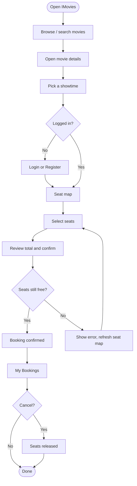
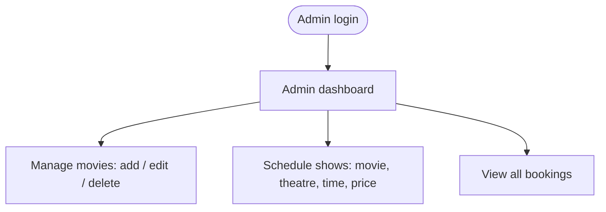

# User Flow

## Customer booking flow

```mermaid
flowchart TD
    A([Open IMovies]) --> B[Browse / search movies]
    B --> C[Open movie details]
    C --> D[Pick a showtime]
    D --> E{Logged in?}
    E -- No --> F[Login or Register]
    F --> G[Seat map]
    E -- Yes --> G
    G --> H[Select seats]
    H --> I[Review total and confirm]
    I --> J{Seats still free?}
    J -- Yes --> K[Booking confirmed]
    J -- No --> L[Show error, refresh seat map]
    L --> H
    K --> M[My Bookings]
    M --> N{Cancel?}
    N -- Yes --> O[Seats released]
    N -- No --> P([Done])
    O --> P
```

## Admin flow

```mermaid
flowchart TD
    A([Admin login]) --> B[Admin dashboard]
    B --> C[Manage movies: add / edit / delete]
    B --> E[Schedule shows: movie, theatre, time, price]
    B --> F[View all bookings]
```
